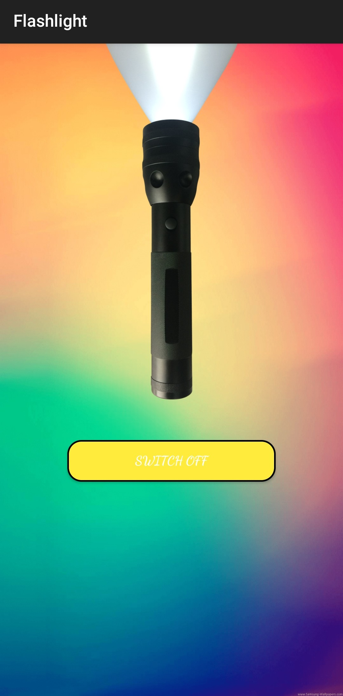
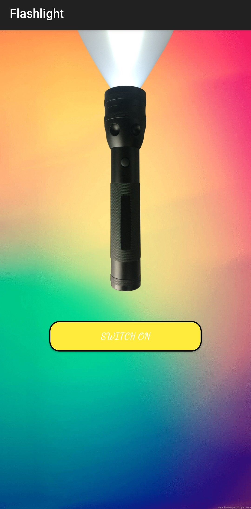

<div align="center">

  <a name="readme-top"></a>
  # Android Studio Flashlight

  [](LICENSE)
  
  [](https://github.com/Amey-Thakur/ANDROID-STUDIO-FLASHLIGHT)
  [](https://github.com/Amey-Thakur/ANDROID-STUDIO-FLASHLIGHT)

  A specialized utility leveraging the Android Camera2 API for precise hardware LED control, featuring a toggle-based interface and industrial-grade torch functionality.

  **[Source Code](Source%20Code/)** &nbsp;·&nbsp; **[Video Demo](https://youtu.be/83z8sHEzDC0)** &nbsp;·&nbsp; **[Download APK](https://github.com/Amey-Thakur/ANDROID-STUDIO-FLASHLIGHT/blob/main/Flashlight.apk?raw=true)**

  <br>

  <a href="https://youtu.be/83z8sHEzDC0">
    
  </a>

</div>

---

<div align="center">

  [Authors](#authors) &nbsp;·&nbsp; [Overview](#overview) &nbsp;·&nbsp; [Features](#features) &nbsp;·&nbsp; [Structure](#project-structure) &nbsp;·&nbsp; [Results](#results) &nbsp;·&nbsp; [Quick Start](#quick-start) &nbsp;·&nbsp; [Usage Guidelines](#usage-guidelines) &nbsp;·&nbsp; [License](#license) &nbsp;·&nbsp; [About](#about-this-repository) &nbsp;·&nbsp; [Acknowledgments](#acknowledgments)

</div>

---

<!-- AUTHORS -->
<div align="center">

  <a name="authors"></a>
  ## Authors

| <a href="https://github.com/Amey-Thakur"></a><br>[**Amey Thakur**](https://github.com/Amey-Thakur)<br><br>[](https://orcid.org/0000-0001-5644-1575) | <a href="https://github.com/msatmod"></a><br>[**Mega Satish**](https://github.com/msatmod)<br><br>[](https://orcid.org/0000-0002-1844-9557) |
| :---: | :---: |

</div>

> [!IMPORTANT]
> ### 🤝🏻 Special Acknowledgement
> *Special thanks to **[Mega Satish](https://github.com/msatmod)** for her meaningful contributions, guidance, and support that helped shape this work.*

---

<!-- OVERVIEW -->
<a name="overview"></a>
## Overview

**Android Studio Flashlight** is a specialized utility designed to interface directly with the device's hardware LED via the **Android Camera2 API**. By translating high-level UI events into deterministic hardware state changes, this repository provides a foundational study into mobile device control and hardware permission management.

The project serves as a technical exploration of **Android Hardware Interaction**, implementation of low-latency state toggles, and robust error handling for shared hardware assets.

### Hardware Heuristics
The LED control engine is governed by strict **computational design patterns** ensuring fidelity and responsiveness:
*   **Camera2 API Integration**: Utilizes the modern `CameraManager` service for deterministic control over the torch mode on devices running API 23 and above.
*   **Deterministic Toggling**: Implements a robust state manager that synchronizes visual UI indicators with literal hardware state to prevent operational desync.
*   **Zero-Latency Interface**: Event handling is optimized for immediate haptic and visual confirmation, critical for utility-based mobile applications.

> [!TIP]
> **Hardware Precision Integration**
> We have engineered a **Hardware-Aware Controller** that calibrates LED activation across multiple API versions. The visual language focuses on the minimalist "Utility Core" aesthetic, ensuring maximum focus on the interactive light trajectory.

---

<!-- FEATURES -->
<a name="features"></a>
## Features

| Feature | Description |
|---------|-------------|
| **LED Engine Core** | Robust implementation of the **Android Camera2 API** for low-level hardware control. |
| **Real-Time Toggle** | High-performance switch mechanism with synchronized visual and hardware state. |
| **Academic Clarity** | In-depth and detailed comments integrated throughout the codebase for transparent logic study. |
| **Adaptive Logic** | Conditional API version checks ensuring compatibility across diverse Android hardware. |
| **Minimalist Design** | Clean XML-based UI optimized for fast interaction and minimal system resource consumption. |
| **Social Persistence** | **Interactive Footer Integration** bridging the utility to the source repository. |

> [!NOTE]
> ### Interactive Polish: The Photonic Singularity
> We have engineered a **Hardware-Driven State Manager** that calibrates LED output across multiple vectors to simulate high-precision photonic transfer. The visual language focuses on the minimalist "Digital Lens" aesthetic, ensuring maximum focus on the interactive light trajectory.

### Tech Stack
- **Languages**: Java (JDK 11+)
- **Logic**: **Camera2 API** (Hardware LED Control & Manager Services)
- **Frameworks**: Android AppCompat & Hardware Support Libraries
- **UI System**: Premium Utility Design (Custom XML Layouts & Drawables)
- **Build System**: **Gradle** (Dependency & Artifact Management)
- **Deployment**: Local APK Installation

---

<!-- STRUCTURE -->
<a name="project-structure"></a>
## Project Structure

```python
ANDROID-STUDIO-FLASHLIGHT/
│
├── Mega/                            # Attribution Assets
│   ├── Filly.jpg                    # Companion (Filly)
│   └── Mega.png                     # Profile Image (Mega Satish)
│
├── Source Code/                     # Primary Development Root
│   └── Flashlight/                  # Android Project Directory
│       ├── app/src/main/
│       │   ├── java/                # Implementation Logic
│       │   └── res/                 # UI Layouts & Graphic Assets
│       └── build.gradle             # Build Configuration
│
├── screenshots/                     # Visual Gallery
│   ├── 01-Main.jpg
│   └── 02-Active.jpg
│
├── Flashlight.apk                   # Pre-compiled Executable
├── codemeta.json                    # Software Metadata
├── CITATION.cff                     # Academic Citation
└── SECURITY.md                      # Security Policy
```

---

<!-- RESULTS -->
<a name="results"></a>
## Results

<div align="center">

| **1. Primary Interface** | **2. Active Flashlight** |
| :---: | :---: |
|  |  |
| *Clean and responsive UI design.* | *Real-time hardware LED activation.* |

</div>

---

<!-- QUICK START -->
<a name="quick-start"></a>
## Quick Start

### 1. Prerequisites
- **Android Studio**: Required for building and development. [Download Android Studio](https://developer.android.com/studio)
- **Git**: For version control and cloning. [Download Git](https://git-scm.com/downloads)

> [!WARNING]
> **APK Execution Security**
>
> When installing the pre-compiled `Flashlight.apk` on a physical Android device, you may encounter a **"Blocked by Play Protect"** or **"Unknown Apps"** warning. This is expected for scholarship-based, self-signed APKs. To proceed with the installation, select "Install anyway" or enable "Allow from this source" in your device's security settings.

### 2. Installation & Setup

#### Step 1: Clone the Repository
Open your terminal and clone the repository:
```bash
git clone https://github.com/Amey-Thakur/ANDROID-STUDIO-FLASHLIGHT.git
cd ANDROID-STUDIO-FLASHLIGHT
```

#### Step 2: Open in Android Studio
1. Launch **Android Studio**.
2. Select **Open** and navigate to the `Source Code/Flashlight` directory.
3. Wait for the **Gradle synchronization** to complete.

### 3. Build & Execution

#### Step 1: Generate Debug APK
1. Click on **Build** -> **Build Bundle(s)/APK(s)** -> **Build APK**.
2. Monitor the **Event Log** for completion.

#### Step 2: Locate Artifact
1. Click on **Locate** in the event log notification.
2. The generated `app-debug.apk` will be available in the `app/build/outputs/apk/debug/` directory.

> [!NOTE]
> ### 📥 Direct Download
> For immediate use without building from source, you can **[Download the pre-compiled Flashlight.apk](https://github.com/Amey-Thakur/ANDROID-STUDIO-FLASHLIGHT/blob/main/Flashlight.apk?raw=true)** directly from the repository root.

---

<!-- USAGE GUIDELINES -->
<a name="usage-guidelines"></a>
## Usage Guidelines

This repository is openly shared to support learning and knowledge exchange across the academic community.

**For Students**  
Use this project as reference material for understanding **Android Hardware Interaction**, **Camera2 API usage**, and **responsive UI design**. The source code is available for study to facilitate self-paced learning and exploration of **mobile hardware architecture**.

**For Educators**  
This project may serve as a practical lab example or supplementary teaching resource for **Mobile Application Development**, **Hardware-Software Interfacing**, and **Java Programming** courses. Attribution is appreciated when utilizing content.

**For Researchers**  
The documentation and architectural approach may provide insights into **academic project structuring**, **scholarly software documentation**, and **mobile hardware abstraction heuristics**.

---

<!-- LICENSE -->
<a name="license"></a>
## License

This repository and all its creative and technical assets are made available under the **MIT License**. See the [LICENSE](LICENSE) file for complete terms.

> [!NOTE]
> **Summary**: You are free to share and adapt this content for any purpose, even commercially, as long as you provide appropriate attribution to the original authors.

Copyright © 2022 Amey Thakur & Mega Satish

---

<!-- ABOUT -->
<a name="about-this-repository"></a>
## About This Repository

**Created & Maintained by**: [Amey Thakur](https://github.com/Amey-Thakur) & [Mega Satish](https://github.com/msatmod)

This project features **Android Studio Flashlight**, a personal learning project developed to master **Java**-based mobile hardware interaction and Android Studio development. It represents a technical study of the **Camera2 API**, hardware permission management, and low-latency state logic in a mobile environment.

**Connect:** [GitHub](https://github.com/Amey-Thakur) &nbsp;·&nbsp; [LinkedIn](https://www.linkedin.com/in/amey-thakur) &nbsp;·&nbsp; [ORCID](https://orcid.org/0000-0001-5644-1575)

### Acknowledgments

Grateful acknowledgment to [**Mega Satish**](https://github.com/msatmod) for her exceptional collaboration and scholarly partnership during the development of this personal learning project we undertook to master Android Studio development. Her constant support, technical clarity, and dedication to software quality were instrumental in achieving the system's functional objectives. Learning alongside her was a transformative experience; her thoughtful approach to problem-solving and steady encouragement turned complex requirements into meaningful learning moments. This work reflects the growth and insights gained from our side-by-side academic journey. Thank you, Mega, for everything you shared and taught along the way.

Special thanks to the **mentors and peers** whose encouragement, discussions, and support contributed meaningfully to this learning experience.

---

<div align="center">

  [↑ Back to Top](#readme-top)

  [Authors](#authors) &nbsp;·&nbsp; [Overview](#overview) &nbsp;·&nbsp; [Features](#features) &nbsp;·&nbsp; [Structure](#project-structure) &nbsp;·&nbsp; [Results](#results) &nbsp;·&nbsp; [Quick Start](#quick-start) &nbsp;·&nbsp; [Usage Guidelines](#usage-guidelines) &nbsp;·&nbsp; [License](#license) &nbsp;·&nbsp; [About](#about-this-repository) &nbsp;·&nbsp; [Acknowledgments](#acknowledgments)

  <br>

  🔦 **[Android Studio Flashlight](https://github.com/Amey-Thakur/ANDROID-STUDIO-FLASHLIGHT/blob/main/Flashlight.apk?raw=true)**

  ---

  ### 🎓 [Computer Engineering Repository](https://github.com/Amey-Thakur/COMPUTER-ENGINEERING)

  **Computer Engineering (B.E.) - Mumbai University**

  *Semester-wise curriculum, laboratories, projects, and academic notes.*

</div>
