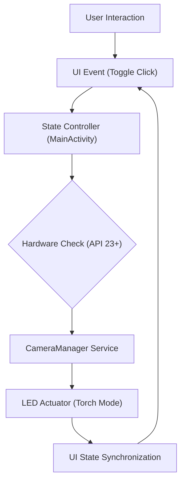

# Technical Specification: Android Studio Flashlight

## Architectural Overview

**Android Studio Flashlight** is a mobile application architecture designed to provide precise hardware LED control within a responsive Android environment. The application serves as a study into mobile device interfacing and low-level hardware state management, utilizing the **Android Camera2 API** and XML-based layouts for high-performance execution on the Android platform.

### Hardware Logic Flow

---

## Technical Implementations

### 1. View Architecture
-   **Activity Model**: Built on the **Android Activity Lifecycle**, ensuring robust state persistence and resource management during mobile execution.
-   **XML Layouts**: Implements optimized XML-based UI definitions with centered geometry for responsive interaction across various screen sizes and orientations.

### 2. Logic & Interfacing
-   **Hardware Execution**: Uses the modern **Camera2 API** (`CameraManager`) to programmatically toggle the device's physical LED torch mode.
-   **State Management**: Event-driven execution synchronized with hardware lifecycle events, ensuring the visual indicator precisely matches the literal hardware status.
-   **Data Processing**: Deterministic command pipeline ensuring zero-latency response critical for utility-based hardware control interfaces.

### 3. Build & Deployment
-   **Gradle System**: The project utilizes the **Gradle Build Tool** to manage dependencies, compilation, and APK generation tasks.
-   **APK Generation**: Artifacts are compiled into signed/unsigned APKs for direct installation and testing on physical devices or emulators.

---

## Technical Prerequisites

-   **Runtime**: Android OS (API Level 23+ for Marshmallow Features).
-   **Development**: Android Studio Bumblebee or later, JDK 11+, and Android SDK.

---

*Technical Specification | Java / Android | Version 1.0*
